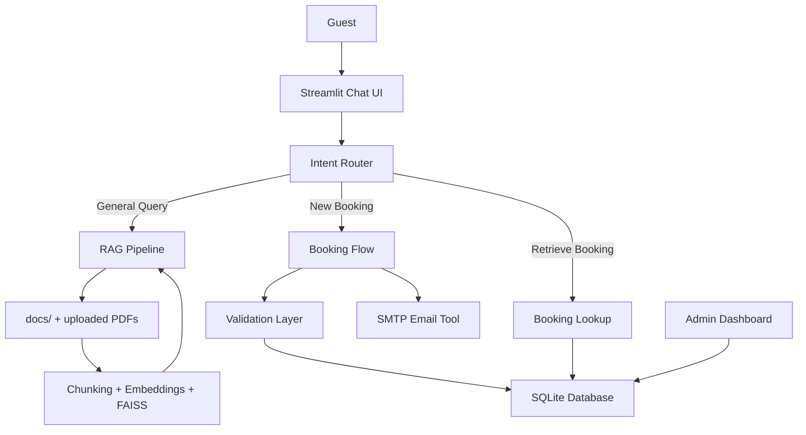

# Architecture Overview

## Use Case

Guests can ask hotel questions, make bookings, and retrieve existing bookings through one conversational assistant.

## Solution Overview

The project uses:

- Streamlit for the frontend
- Groq for intent detection, slot extraction, and response generation
- sentence-transformers plus FAISS for retrieval
- SQLite for booking persistence
- Gmail SMTP for confirmation emails

## Architecture Diagram

## RAG Design

- Auto-ingests bundled docs from `docs/` on startup
- Accepts user-uploaded PDFs at runtime
- Chunks text and embeds with `all-MiniLM-L6-v2`
- Uses FAISS for top-k retrieval
- Injects retrieved excerpts into the final assistant prompt

## Booking Flow

1. Detect intent
2. Pre-fill known details from conversation history
3. Ask only for missing fields
4. Validate phone, email, date, and time
5. Summarize details
6. Ask explicit confirmation
7. Save to DB and send email
